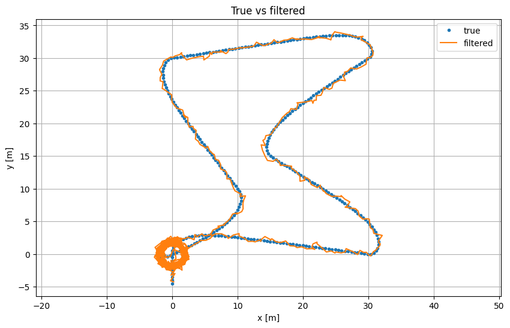
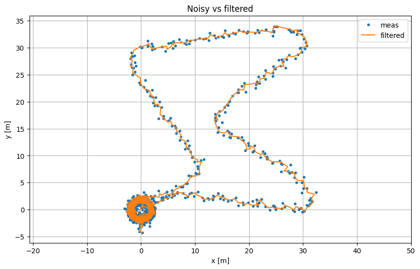
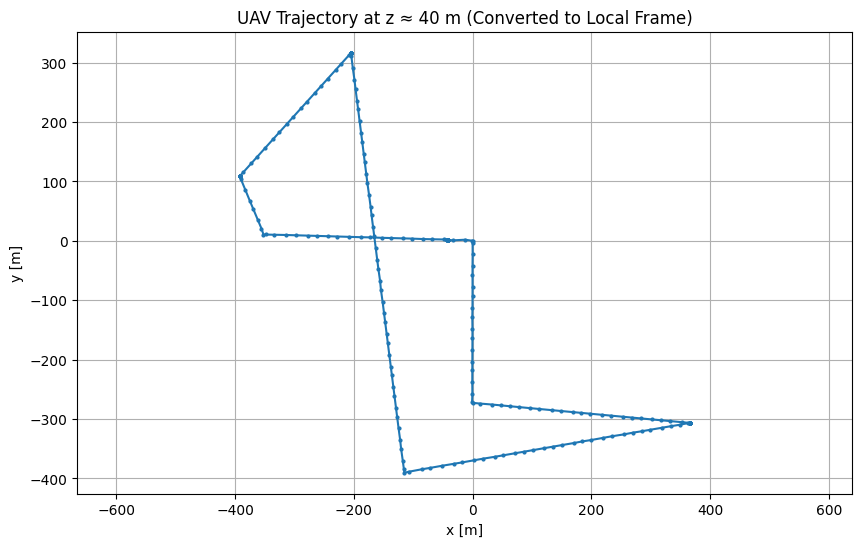
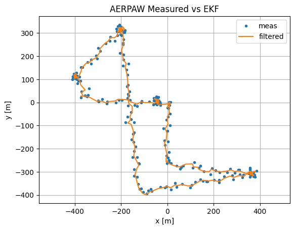

# UAV State Estimation and Motion Modeling System

Extended Kalman Filter (EKF)-based state estimation pipeline for UAV motion, developed for **ENAE380: Flight Software Systems** at the University of Maryland (Fall 2025), and validated on both simulated trajectories and real UAV flight data.

## Overview

Sensors like GPS provide UAV position measurements that are noisy, irregularly sampled, and imperfect. This project implements a Kalman-filter-style state estimator that fuses a constant-velocity motion model with noisy position measurements to recover a smoother, physically consistent estimate of a UAV's position and velocity.

The system was developed in three stages:
1. A simulated, waypoint-following planar UAV trajectory with known ground truth, used to validate the filter numerically.
2. A reusable estimator library, refactored out of notebook prototyping into a standalone Python module.
3. Application to real UAV flight data from the [AERPAW RF Sensor Measurements with UAV (July 2024)](https://aerpaw.org/dataset/aerpaw-rf-sensor-measurements-with-uav-july-2024/) dataset, which required coordinate conversion, timestamp handling, and scoping decisions around real-data artifacts.

📄 **[Full Design Report](docs/design_report.pdf)** — complete derivation, iteration history, and results.

## Key Features

- Constant-velocity Kalman/EKF-structured estimator with predict/update cycle
- Data-driven or manually tuned measurement noise covariance (`R`)
- Joseph-form covariance update for numerical stability
- CSV-driven runner that works with any compatible trajectory log
- Optional Streamlit UI for interactive parameter tuning
- Real-world data preprocessing pipeline: lat/lon → local Cartesian conversion, timestamp normalization, altitude-based scoping

## State-Estimation Model

**State vector** (position + velocity):

$$
\mathbf{x} = \begin{bmatrix} x & y & v_x & v_y \end{bmatrix}^T
$$

**Measurement vector** (GPS-like position):

$$
\mathbf{z} = \begin{bmatrix} x_{meas} & y_{meas} \end{bmatrix}^T
$$

**Motion model** (constant velocity):

$$
f(\mathbf{x}, \Delta t) =
\begin{bmatrix}
x + v_x \Delta t \\
y + v_y \Delta t \\
v_x \\
v_y
\end{bmatrix}
$$

**State transition matrix:**

$$
F =
\begin{bmatrix}
1 & 0 & \Delta t & 0 \\
0 & 1 & 0 & \Delta t \\
0 & 0 & 1 & 0 \\
0 & 0 & 0 & 1
\end{bmatrix}
$$

**Measurement model:**

$$
H =
\begin{bmatrix}
1 & 0 & 0 & 0 \\
0 & 1 & 0 & 0
\end{bmatrix}
$$

> **Note:** the underlying motion and measurement models here are linear, so this is technically a standard Kalman Filter. The predict/update structure is implemented in EKF form (with separate `F`/`H` construction) so the estimator can later be extended to nonlinear models — e.g. heading/yaw dynamics or IMU-driven state transitions — without a redesign.

## EKF Methodology

**Predict (time update):**

$$
\hat{x}_k^- = F \hat{x}_{k-1}^+, \qquad P_k^- = F P_{k-1}^+ F^T + Q
$$

**Update (measurement correction):**

$$
\nu_k = z_k - H\hat{x}_k^-, \qquad S_k = HP_k^- H^T + R, \qquad K_k = P_k^- H^T S_k^{-1}
$$

$$
\hat{x}_k^+ = \hat{x}_k^- + K_k \nu_k
$$

$$
P_k^+ = (I - K_k H) P_k^- (I - K_k H)^T + K_k R K_k^T
$$

The covariance update uses the **Joseph form** rather than the simplified form, which keeps `P` symmetric and numerically stable over long runs — this matters for real (imperfect, long) UAV logs.

**Process noise (`Q`)** is built from a white-acceleration model, parameterized by a single tunable scalar `q_accel`. Larger `q_accel` allows the filter to respond more aggressively to maneuvers at the cost of noisier output; smaller values produce smoother but laggier estimates.

**Measurement noise (`R`)** can be estimated directly from data when ground truth is available (`variance of measurement − truth`), or set manually when working with real logs where no truth exists.

## Development Process

Development followed an iterative, notebook-first workflow, documented in full in the [design report](docs/design_report.pdf):

1. **Simulation motion model** — generated a repeatable, waypoint-following trajectory with known ground truth and injected measurement noise.
2. **EKF implementation in the notebook** — built and tested the predict/update loop, iterated on `Q`/`R` tuning.
3. **Transition to AERPAW data** — discovered the dataset used lat/lon/altitude rather than planar coordinates, requiring a coordinate transform.
4. **Time conversion** — converted `HH:MM:SS` timestamps to continuous seconds for consistent `Δt`.
5. **Altitude-driven scoping decision** — real trajectory data showed discontinuities tied to altitude changes; rather than extend to 3D, the dataset was scoped to a planar (~40 m altitude) segment.
6. **Noise injection** — the real AERPAW positions were effectively noise-free, so Gaussian noise was injected to create a realistic test case for the filter.
7. **Refactor into a library** — the validated notebook logic was extracted into `EKF.py`, with `run_uav_EKF.py` as a standalone driver and `app.py` as an optional UI.

## AERPAW Data Preprocessing

Real UAV positions in the AERPAW dataset are recorded as latitude/longitude at a nominal altitude. To use them with a planar Cartesian motion model, the pipeline performs:

- **Local tangent-plane conversion**, using the first sample as a reference point:

$$
x = R(\lambda - \lambda_0)\cos(\phi_0), \qquad y = R(\phi - \phi_0), \qquad R = 6{,}378{,}137 \text{ m}
$$

- **Timestamp conversion** from `HH:MM:SS` to continuous seconds.
- **Altitude filtering** to an approximately 40 m band, to keep the dataset consistent with the planar (2D) model.
- **Gaussian noise injection** to emulate realistic GPS-like measurement uncertainty, since the raw processed positions showed little to no visible noise.

## Software Architecture
```text

src/

├── EKF.py          # UAV2DEKF estimator library (predict/update, Joseph-form covariance)

├── run_uav_EKF.py  # CSV-driven experiment runner: loads data, runs the filter, and plots results

└── app.py          # Optional Streamlit UI for interactive parameter tuning

```


The estimator logic (`EKF.py`) is intentionally decoupled from plotting, file I/O, and UI concerns — mirroring how a state estimator would sit as an independent subsystem in a real flight software stack.

> **Current scope:** `EKF.py` implements the 4-state, position-only estimator (`UAV2DEKF`). `run_uav_EKF.py` checks for optional heading columns (`psi_meas`, `omega_meas`) in a CSV and is structured to route to a 6-state heading-augmented estimator when they're present; that 6-state estimator is **not yet implemented** in this version of `EKF.py` (see Limitations).

## Results

*(All figures generated from `notebooks/development_notebook.ipynb`; see the [design report](docs/design_report.pdf) for the full figure set and discussion.)*

**Simulation (ground truth available):**

| Simulation: True vs. EKF Estimate | Simulation: Measured(Noise) vs. EKF Estimate |
|---|---|
|  |  |

On simulated trajectories, the filter visibly smooths noisy position measurements while tracking the known ground-truth path, and produces velocity estimates that are not directly measured.

**AERPAW real flight data:**

| Raw AERPAW Data  | AERPAW: Measured(with added noise) vs. EKF Estimate |
|---|---|
|  |  |

On the AERPAW-derived planar segment, the filter smooths the injected-noise trajectory while preserving the overall path geometry. Evaluation in this project was qualitative/visual (trajectory comparison), rather than a formal quantitative benchmark — see [Limitations](#current-limitations).

## Repository Structure
```text

uav-ekf-state-estimation/

├── src/              # EKF library, driver script, and optional UI

├── notebooks/        # Simulation, EKF development, and AERPAW preprocessing

├── data/

│   └── sample/       # Small sample CSV for testing; full AERPAW dataset not included

├── results/

│   └── figures/      # Exported result plots

└── docs/             # Design report, project proposal, and user documentation

```

## Installation

```bash
git clone https://github.com/<your-username>/uav-ekf-state-estimation.git
cd uav-ekf-state-estimation

python -m venv venv
source venv/bin/activate      # Windows: venv\Scripts\activate

pip install -r requirements.txt
```

## Usage

Run the estimator on a CSV trajectory log:

```bash
cd src
python run_uav_EKF.py
```

Edit the `CSV_FILE` path near the top of `run_uav_EKF.py` to point at your dataset (a small sample is provided in `data/sample/`).

Optional interactive UI:

```bash
cd src
streamlit run app.py
```

Full setup, troubleshooting, and step-by-step run instructions: **[User Documentation](docs/user_documentation.pdf)**.

## Input Data Format

| Column | Required | Description |
|---|---|---|
| `t` | Yes | Time (seconds) |
| `x_meas`, `y_meas` | Yes | Measured position |
| `x_true`, `y_true` | No | Ground truth, enables RMSE and truth-based `R` estimation |
| `psi_meas`, `omega_meas` | No | Heading/yaw-rate — **not currently supported by the estimator library** (see Limitations) |

## Current Limitations

- **4-state, position-only model.** The estimator assumes constant-velocity planar motion; it does not model heading, altitude, or acceleration inputs.
- **6-state heading mode is referenced but not implemented.** `run_uav_EKF.py` is structured to select a heading-augmented estimator when `psi_meas`/`omega_meas` are present, but `EKF.py` currently only implements the 4-state `UAV2DEKF`.
- **No IMU or additional sensor fusion.**
- **Planar-only real-data handling.** AERPAW data is scoped to a fixed altitude band; altitude changes are filtered out rather than modeled.
- **Evaluation is primarily qualitative.** RMSE can be computed against ground truth in simulation, but this project did not use it as a formal benchmark or report a specific tuning result.
- **Offline / batch processing only.** The pipeline reads logged CSV data; it is not connected to a live sensor stream.

## Future Work

- Extend the state to full 3D, incorporating altitude dynamics explicitly.
- Fuse IMU (accelerometer/gyroscope) data to reduce reliance on the constant-velocity assumption.
- Implement innovation gating / outlier rejection for large measurement jumps.
- Add automated parameter sweeps, logged innovation statistics, and summary tables across datasets.
- Real-time / embedded deployment as part of a longer-term flight-computer development effort.

## References

1. MathWorks, *Extended Kalman Filters*. https://www.mathworks.com/help/fusion/ug/extended-kalman-filters.html
2. R. Murray, *System Modeling*, Caltech. https://web.archive.org/web/20080713164136/http://www.cds.caltech.edu/~murray/amwiki/index.php?title=System_Modeling
3. UIUC Computer Vision Group, *Coordinate Transformations for Robotic Systems*. https://motion.cs.illinois.edu/RoboticSystems/CoordinateTransformations.html
4. AERPAW Project Team, *AERPAW RF Sensor Measurements with UAV (July 2024)*. https://aerpaw.org/dataset/aerpaw-rf-sensor-measurements-with-uav-july-2024/
5. A. Haber, *Extended Kalman Filter Tutorial with Example and Disciplined Python Codes (Part II)*. https://aleksandarhaber.com/extended-kalman-filter-tutorial-with-example-and-disciplined-python-codes-part-ii-python-codes/

## Author

**Darius Gichuru**
ENAE380: Flight Software Systems, Fall 2025
Undergraduate Aerospace Engineering & Physics Student
University of Maryland, College Park

